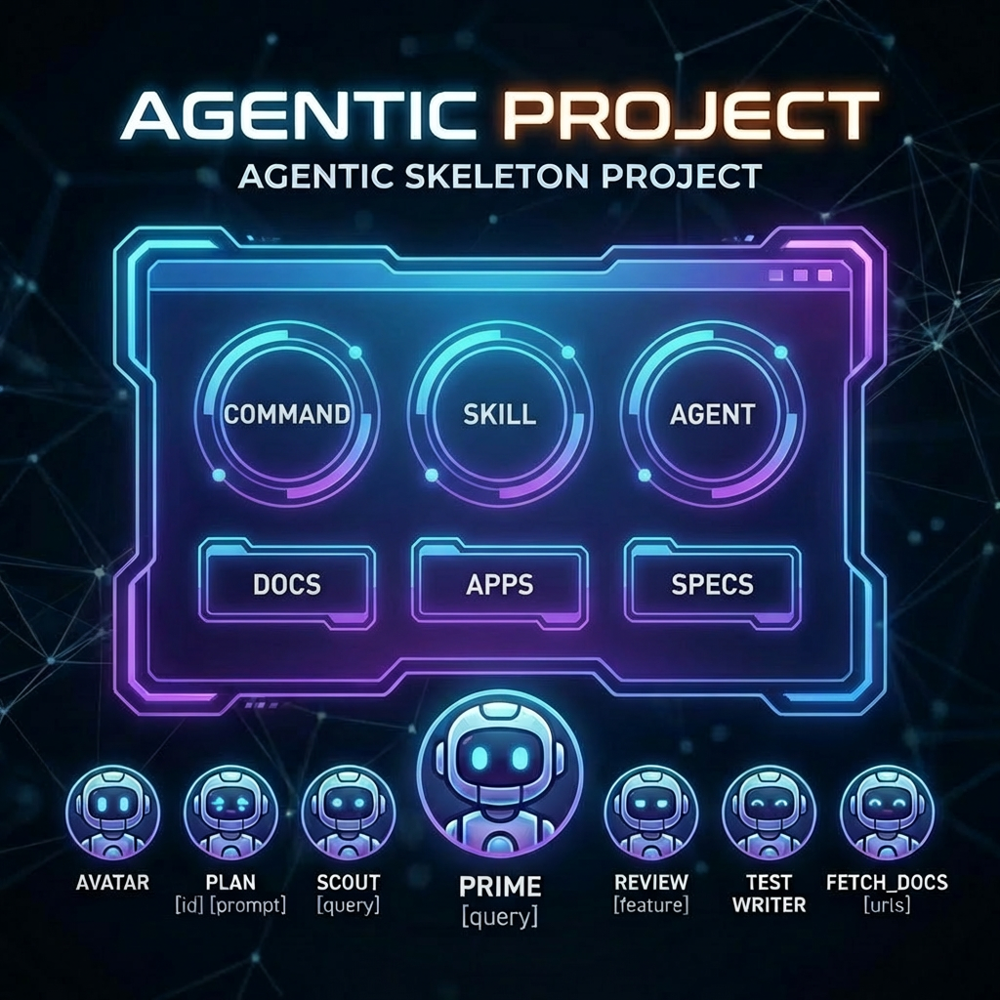

# Agentic Project

Remember the waterfall model from the 70s?
`requirements → specification → design → build → test → release → maintenance`


Now that AI is here, let's *bring it back* with a twist!


This is a `skeleton project` designed for:
- **Spec-Driven Requirements Gathering**: idea → research → mission → … → plan
- **Mockup-First Web UI**: clickable HTML artifacts in `dashboard/` validate the product *before* code — so specs, design, and build all converge on something you can actually see and click.
- **Spec-Driven Delivery**: gated pipeline — plan → spec → design → build → test → release — each stage has exit criteria before advancing.
- **Agentic Development**: structured to support AI agents with defined `commands` / `skills` / `CLAUDE.md`

Think of it as a starting point of a project, right from project discovery stage.

---

## Setup

`bootstrap` your existing (or new) project by running:
```bash
python3 scripts/bootstrap.py ~/path_to_your_project
```

Copies `.claude/` and `CLAUDE.md` into the target. On conflicts it prompts **Overwrite / Skip / Diff / Merge** (Merge appends, `.md` only), plus **All overwrite / All skip** to apply one choice to the rest.

Don't forget to run **Prime** to familiarize the agent with your codebase. When your project is up and running then do **prime_feedback** (`.claude/commands/PRIME_FEEDBACK.md`) to set up your project for autonomous, self-correcting development and get minimum 2x better results when working with AI ;)

Also check out my `YAY.md` command. Super useful. I run it 20x a day to keep code clean.

**WARNING!** *Don't fall into the agentic trap!!!* Using agents or too many rules to follow can drastically decrease your LLM output quality! Read more at the end of this file. Keep CLAUDE.md around 200 instructions tops. Read below why.

Special thanks to **@IndyDevDan** and his YouTube video that inspired this project: [YouTube video](https://www.youtube.com/watch?v=fop_yxV-mPo)

---

## Overview

1. **Agents / Commands / Skills**: `.claude/` — the AI tooling (agents invoked by slash commands, plus executable skills)
2. **Plan**: `plan/` — stage 1. Idea → research → mission → decisions → business plan. See [plan/04-STAGES.md](plan/04-STAGES.md) for gate criteria.
3. **Spec & Design**: `specs/` — what is being built (FR / NFR / use cases) and how (logical / process / physical views, data model, interface contracts)
4. **UI artifacts**: `dashboard/` — static pages that match the spec's use cases, handed off to implementation
5. **Code**: `src/` — `backend/` (FastAPI) + `frontend/` (client app)
6. **Reviews**: `reviews/` — security audits and design reviews, usually run by agents
7. **Docs**: `docs/` — ADRs (`adr/`), cached Anthropic docs for agents (`anthropic/`), UML diagrams (`uml/`)

---

## Agents & Commands
- **Prime**: `prime [query]` — familiarize the agent with the codebase
- **Prime DB w/ Tools**: `prime_db_w_tools` — prime with database context via psql
- **Bootstrap Feedback Loop**: `prime_feedback` — One-time setup for autonomous, self-correcting development (log capture, process output, `.claude/PROJECT_LOOP.md`)
- **Agents Loops Extension**: `agents_loops_extension` — autonomous feedback loop protocol
- **Plan**: `plan [id] [prompt]`
- **Build**: `build` — implement from plan
- **Scout**: `scout [query]`
- **Review**: `review [feature]`
- **Reproduce**: `reproduce` — reproduce a bug and document steps
- **Test BE / Test FE**: `test_be` / `test_fe` — closed-loop pytest
- **Start Apps**: `start_apps`
- **Yay**: `yay` — de-sloppify after multiple fix attempts
- **Pull Ticket**: `pull_ticket` — pull a Jira ticket
- **Document**: `document` — generate docs or specs for code
- **Test Writer**: `test_writer` (agent)
- **Documentation Fetcher**: `fetch_docs [urls]` (agent)

## Project Structure

```text
.
├── .claude/                          # Agents, Commands, and Skills
│   ├── agents/                       # Agent definitions
│   │   ├── FETCH_DOCS.md             # Documentation fetcher agent
│   │   ├── REVIEW_AGENT.md           # Code review agent
│   │   ├── SCOUT.md                  # Codebase scout agent
│   │   └── TEST_WRITER.md            # Test writing agent
│   ├── commands/                     # Command definitions
│   │   ├── AGENTS_LOOPS_EXTENSION.md # Autonomous feedback loop protocol
│   │   ├── BUILD.md                  # Build/implementation command
│   │   ├── DOCUMENT.md               # Documentation generator
│   │   ├── PLAN.md                   # Planning command
│   │   ├── PRIME.md                  # Codebase priming
│   │   ├── PRIME_DB_W_TOOLS.md       # Prime with DB context via psql
│   │   ├── PRIME_FEEDBACK.md         # Autonomous feedback loop setup
│   │   ├── PULL_TICKET.md            # Jira ticket puller
│   │   ├── REPRODUCE.md              # Bug reproduction
│   │   ├── REVIEW.md                 # Code review command
│   │   ├── SCOUT.md                  # Scout command
│   │   ├── START_APPS.md             # App startup command
│   │   ├── TEST_BE.md                # Backend testing
│   │   ├── TEST_FE.md                # Frontend testing
│   │   └── YAY.md                    # De-sloppify after repeated fixes
│   ├── skills/                       # Executable skills
│   │   ├── db-migrate/               # Database migration skill
│   │   ├── start-stop-app/           # App lifecycle management
│   │   └── (+ Anthropic official skills — see below)
│   └── settings.local.json           # Claude Code Allow/Deny permissions
├── scripts/
│   ├── bootstrap.py                  # Copies .claude/ + CLAUDE.md into target project
│   └── linters/                      # Per-stack linters (python/cpp/swift/php/angular/quake3)
├── docs/                             # Project documentation for AI context
├── src/                              # Application source code
│   ├── client/                       # Python client application
│   └── server/                       # FastAPI/Python server application
├── plan/                             # Stage-1 planning (idea → decisions)
├── specs/                            # Technical specifications
│   ├── 01-SPECIFICATION_v1.0.md              # Project specification (filled)
│   ├── 02-TEMPLATE-SPECIFICATION_OMG_v1.0.md # OMG-UML-2.5.1 specification template
│   ├── 03-SPECIFICATION_OMG_HOWTO_v1.0.md    # Walkthrough for filling the spec template
│   ├── 04-TEMPLATE-DESIGN_OMG_v1.0.md        # IEEE-1016 / RUP / 4+1 design template
│   └── 05-DESIGN_v1.0.md                     # Project design document (filled)
├── dashboard/                        # Static UI artifacts
├── reviews/                          # Security and design reviews
├── BOOTSTRAP.md                      # One-time boot actions (invoked by CLAUDE.md)
├── CHANGELOG.md
└── CLAUDE.md                         # Main entry point for AI agents
```

### Anthropic official skills included under `.claude/skills/`
`algorithmic-art`, `brand-guidelines`, `canvas-design`, `claude-api`, `doc-coauthoring`, `docx`, `frontend-design`, `internal-comms`, `mcp-builder`, `pdf`, `pptx`, `skill-creator`, `slack-gif-creator`, `theme-factory`, `web-artifacts-builder`, `webapp-testing`, `xlsx`.

## Reference Links
- [YouTube video](https://www.youtube.com/watch?v=fop_yxV-mPo)
- [Agentic Engineer](https://agenticengineer.com/)
- [Model Context Protocol (MCP)](https://modelcontextprotocol.io/)


# LLM Instruction-Following Capacity

> Research-backed data on how many instructions LLMs can follow simultaneously, across multiple benchmarks and sources.

Last updated: February 2026

---

## The Core Question

> **"How many instructions can an LLM follow with reasonable consistency?"**

---

## Source Index

| # | Source | Type | What it measures |
|---|---|---|---|
| S1 | **IFScale** — Distyl AI (July 2025) | Academic benchmark | Accuracy at 10→500 simultaneous keyword instructions |
| S2 | **"Curse of Instructions"** — ICLR 2025 | Academic paper | Success rate at exactly 10 simultaneous instructions |
| S3 | **AGENTIF** — Tsinghua University (2025) | Academic benchmark | Constraint success in real agentic scenarios |
| S4 | **IFEval** — Scale AI leaderboard | Standard benchmark | Single-constraint accuracy (simple, verifiable) |
| S5 | **HumanLayer blog** | Practitioner estimate | Rule-of-thumb from production deployments |
| S6 | **Qualitative / coding evals** | Real-world testing | Observed behavior in coding tasks |

---

## Master Comparison Table

| Model | S1: IFScale @ 500 instr. | S2: 10 instr. success | S3: AGENTIF agentic | S4: IFEval (simple) | Decay pattern | Notes |
|---|---|---|---|---|---|---|
| **o3** (OpenAI) | **62.8%** 🥇 | — | — | **91.96%** 🥇 | Threshold | Best overall; holds until cliff |
| **gemini-2.5-pro** | **~65%** 🥇 | — | — | 86.58% | Threshold | Holds stable longest before breaking |
| **grok-3** | **61.9%** | — | — | — | Stable | Near o3 performance, no reasoning mode |
| **GLM-4.7** | not tested | — | 41% Terminal Bench | **88%** ⭐ | unknown | Best open-source IFEval; interleaved thinking |
| **GLM-4 (32B)** | not tested | — | TAU-Bench strong | **87.6%** | unknown | Highest IFEval for its size class |
| **DeepSeek R1** | 30.9% | — | — | **87.75%** 🥈 | Collapse | Strong IFEval, but collapses at high density |
| **claude-3.7-sonnet** | **52.7%** | — | — | — | Linear | Predictable; older model outperforms newer |
| **Claude 3.5 Sonnet** | — | **44%** → 58%* | — | 85.96% | Linear | *improves to 58% with self-refinement feedback |
| **GPT-4.1** | linear decay | — | — | — | Linear | Steady, predictable decline |
| **claude-opus-4** | **44.6%** | — | — | — | Linear | Surprisingly weaker than claude-3.7 |
| **claude-sonnet-4** | **42.9%** | — | unstable 150-300 | — | Linear | Critical instability zone at mid-density |
| **o1-mini** | — | — | **59.8%** CSR best | — | — | Best constraint success rate in agentic eval |
| **deepseek-r1** | **30.9%** | — | — | 87.75% | Collapse | Underperforms for a reasoning model at density |
| **qwen3** | **26.9%** | — | — | — | Collapse | Below expectations for large new-gen model |
| **GPT-4o** | **~15%** 💀 | **15%** 💀 | 58.5% (↓ from 87%) | 85.29% | Exponential | Most misleading model — great on paper, fails in practice |
| Frontier models (general) | — | — | — | — | — | ~150–200 instructions "reasonable" (practitioner est.) |
| Mid-tier models | collapse 150–300 | — | — | — | — | Critical instability zone |
| Worst models | collapse at ~20–30 | — | — | — | — | Overwhelmed by a few dozen |

---

## Rankings — Best to Worst Overall

### 🟢 Top Tier — Holds under pressure

| Rank | Model | Strength | Weakness |
|---|---|---|---|
| 1 | **o3** | IFEval 91.96%, IFScale 62.8%, threshold decay | Very slow at high density (219s @ 250 instr.) |
| 2 | **gemini-2.5-pro** | ~65% @ 500 instr., holds stable longest | Variance increases as it approaches cliff |
| 3 | **grok-3** | 61.9% @ 500 instr., low variance, no reasoning mode needed | Less tested overall |
| 4 | **GLM-4.7** | 88% IFEval, interleaved thinking, open-source, MIT licensed | Not tested at high instruction density |
| 5 | **GLM-4 (32B)** | 87.6% IFEval, strong tool use (TAU-Bench) | Older, smaller model |

### 🟡 Middle Tier — Predictable but degrading

| Rank | Model | Strength | Weakness |
|---|---|---|---|
| 6 | **claude-3.7-sonnet** | 52.7% @ 500, linear decay — easy to plan around | Older model |
| 7 | **Claude 3.5 Sonnet** | 85.96% IFEval, improvable with feedback | 44% on 10 simultaneous — needs self-correction |
| 8 | **GPT-4.1** | Linear decay pattern — consistent | No IFScale score published |
| 9 | **claude-opus-4** | 44.6% @ 500 | Weaker than its older predecessor (3.7) |
| 10 | **claude-sonnet-4** | 42.9% @ 500 | Unstable in 150–300 instruction zone |

### 🔴 Bottom Tier — Collapses early

| Rank | Model | Issue |
|---|---|---|
| 11 | **deepseek-r1** | 30.9% @ 500 — underperforms for a reasoning model |
| 12 | **qwen3** | 26.9% @ 500 — below expectations |
| 13 | **GPT-4o** | **Worst overall** — 15% @ 500 AND 15% at just 10 instructions; exponential decay; floors at 7–15% |

---

## Degradation Patterns Explained

Three distinct patterns emerge from the IFScale study (Distyl AI, 2025):

### 1. Threshold Decay 📉
**Models: o3, gemini-2.5-pro**

```
Accuracy
100% |████████████████████
 80% |                    ████
 60% |                        ██████
 40% |                              ████████
     |__________________________|_________
     0        100       200      300     500 instructions
                              ^ cliff point
```
- Near-perfect performance until a critical density threshold
- Then: rising variance and steeper decline
- **Best pattern for real-world use** — you know the safe zone

### 2. Linear Decay 📉
**Models: gpt-4.1, claude-3.7-sonnet, claude-sonnet-4**

```
Accuracy
100% |██
 80% |  ████
 60% |      ████
 40% |          ████
 20% |              ████
     |________________________
     0    100    200    300    500 instructions
```
- Steady, predictable decline across the density spectrum
- **Most manageable in production** — degradation is foreseeable
- No sudden cliffs

### 3. Exponential Decay 💀
**Models: gpt-4o, llama-4-scout, claude-3.5-haiku**

```
Accuracy
100% |██
 80% |  ██
 60% |    ██
 40% |      █
 20% |       █████████████████ (floor ~7-15%)
     |________________________
     0  20  50   100   200   500 instructions
```
- Rapid early collapse
- Levels off at accuracy floor of 7–15%
- **Avoid for instruction-dense tasks entirely**

---

## Key Research Findings

### Finding 1 — IFEval scores are misleading
Simple benchmarks flatter models dramatically. GPT-4o scores **85.29% on IFEval** (simple, single constraints) but **15% on 10 simultaneous real instructions** (Curse of Instructions, ICLR 2025). The gap between benchmark and reality is enormous.

### Finding 2 — The "150–200 instructions" rule is optimistic
The practitioner estimate of 150–200 instructions (HumanLayer blog) applies only to top-tier frontier models under ideal conditions. Research shows:
- Mid-tier models start breaking at **50–100 instructions**
- Worst models collapse at **~20–30 instructions**
- Even best models drop below 70% accuracy at 500 instructions

### Finding 3 — Reasoning models trade speed for capacity
Reasoning models (o3, o4-mini) hold more instructions but get dramatically slower:
- o4-mini: 12.4s → 436.19s as density goes from 10 → 250 instructions
- o3: 26.3s → 219.58s at 250 instructions
- General-purpose models: stable latency regardless of density

### Finding 4 — Primacy bias is universal
All models pay more attention to **earlier instructions** than later ones. In long instruction lists, instructions at the end are most likely to be dropped. This has a direct implication: **put your most important rules first**.

### Finding 5 — Agentic scenarios are harder
Real agentic tasks (chained, multi-step, tool-using) perform far worse than single-prompt benchmarks:
- GPT-4o: 87% IFEval → **58.5% AGENTIF** (32% drop)
- o1-mini best CSR in agentic: only **59.8%**

### Finding 6 — 10 instructions is already hard
"Curse of Instructions" (ICLR 2025): at just **10 simultaneous instructions**, GPT-4o only succeeds 15% of the time. Even Claude 3.5 Sonnet manages only 44%. This is the most sobering finding in all the research.

---

## Practical Implications for CLAUDE.md / Spec Files

| File | Recommended limit | Reasoning |
|---|---|---|
| `CLAUDE.md` (global rules) | **< 60 lines** | Goes into every session; competes with system prompt (~50 instr. already used) |
| `spec.md` / PRP | Can be longer | Focused on one task; model isn't holding competing contexts |
| Per-step instructions | **< 10 clear rules** | "Curse of Instructions" shows 10 is already hard for most models |
| Total instruction budget | **~150 for top models** | 200 is optimistic; plan for degradation starting at 100 |

### Rule of thumb
> **Every instruction you add costs you something on every other instruction.**
> The question is always: is this instruction worth the tax it puts on everything else?

---

## GLM Special Notes

GLM (Zhipu AI / Z.ai) is notable because:

1. **Strong IFEval for open-source**: GLM-4.7 scores 88%, GLM-4 (32B) scores 87.6% — above GPT-4o and Claude 3.5 Sonnet on the simple benchmark
2. **Not tested in IFScale** — no high-density data available yet
3. **Architectural advantage**: GLM-4.7 introduces Interleaved Thinking — reasons before every response and tool call, which improves instruction adherence in complex scenarios
4. **Agent improvement**: Terminal Bench 2.0 jumped from 24.5% (GLM-4.6) to 41.0% (GLM-4.7) — a +16.5% gain in real multi-step task execution
5. **Open-source / MIT licensed** — self-hostable; relevant for privacy-sensitive deployments

---

## Summary — What Actually Works

| Strategy | Effect |
|---|---|
| Keep global rules under 60 lines | Prevents diluting the most important constraints |
| Put critical instructions first | Exploits primacy bias in your favor |
| Use layered specs (global + per-task) | Avoids cognitive overload in single context |
| Use reasoning models for instruction-dense tasks | o3/gemini-2.5-pro hold up better at high density |
| Don't rely on IFEval scores alone | They overestimate real-world performance significantly |
| Test with self-refinement feedback | Claude 3.5 Sonnet improves from 44% → 58% at 10 instructions with feedback |

---

## Sources

| Source | URL |
|---|---|
| IFScale benchmark (Distyl AI, 2025) | https://arxiv.org/abs/2507.11538 |
| "Curse of Instructions" (ICLR 2025) | https://openreview.net/forum?id=R6q67CDBCH |
| AGENTIF benchmark (Tsinghua 2025) | https://keg.cs.tsinghua.edu.cn/persons/xubin/papers/AgentIF.pdf |
| Scale AI IFEval Leaderboard | https://scale.com/leaderboard/instruction_following |
| HumanLayer — Writing a good CLAUDE.md | https://www.humanlayer.dev/blog/writing-a-good-claude-md |
| GLM-4.7 benchmarks | https://automatio.ai/models/glm-4-7 |
| GLM-4 (32B) IFEval | https://www.marktechpost.com/2025/04/14/thudm-releases-glm-4 |
